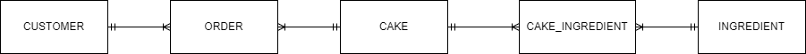

<!-- @import "[TOC]" {cmd="toc" depthFrom=1 depthTo=6 orderedList=false} -->

# AACS3013 MAY 2022 Answers

[Link to the paper](https://eprints.tarc.edu.my/21167/1/AACS3013.pdf)

- [Question 1](#question-1)
- [Question 2](#question-2)
- [Question 3](#question-3)
- [Question 4](#question-4)

## Answers

### Question 1

a) i)

- Data is raw facts about things and events that have no context, while information is processed and organised data that has meaning.

a) ii)
- Example of data : "36.7 degree celsius" which is the recorded temperature of a user during a health check. This is just a single raw piece of data captured during a temperature screening that has no meaning by itself.
- Example of information : "User has had a normal body temperature for the past 14 days" which is considered an information that is derived by processing multiple temperature readings, and intepreting them in the context of health monitoring, providing a meaningful summary of the user's health status over the specific period of time.

b)
#### 3 importance of specifying business rules in an organization
- Business rules serve as a communication tool between users and database designers.
- Business rules standardize the company's view of data.
- Business rules help database designers to understand business processes.

c) 
#### 5 main components of a database system environment
- Hardware
- Software
- People
- Procedures
- Data

d) i)
```sql
SELECT * FROM STAFFB
MINUS
SELECT * FROM StaffA;
```

d) ii)
```sql
SELECT * FROM StaffB b
LEFT JOIN Department d ON b.DeptID = d.DeptID;
```
> Use left join, otherwise S05 record will not exist in output.

### Question 2

a)



b)

CUSTOMER(<ins>CustomerID</ins>, CustomerName, ContactNo)

CAKE(<ins>CakeID</ins>, Description, Price)

INGREDIENT(<ins>IngredientID</ins>, Name)

ORDER(<ins>OrderID</ins>, CustomerID\*, CakeID\*, OrderDate, Quantity)

CAKE_INGREDIENT(<ins>CakeID\*</ins>, <ins>IngredientID\*</ins>, IngredientAmount)


### Question 3

a) 

- Insertion Anomaly: Insertion of new customer data requires to insert redundant home and staff data.
- Modification Anomaly: Modification of price per night data of H01 needs to be made to all data that contains the specific home ID H01 to avoid data inconsistency.
- Deletion Anomaly: Deletion of H04 will cause the customer C002 data to be removed from the database.

b)

**1NF**

HOME(<ins>HomeID</ins>, Description, PricePerNight, StaffID, StaffHP, <ins>CustomerID</ins>, CustomerName, CustomerHP, CheckInDate, CheckOutDate)

> Use the **entity name of the non-repeating group** as the table name

**2NF**

HOME(<ins>HomeID</ins>, Description, PricePerNight, StaffID, StaffHP)

BOOKING(<ins>HomeID\*</ins>, <ins>CustomerID\*</ins>, <ins>CheckInDate</ins>, CheckOutDate)

CUSTOMER(<ins>CustomerID</ins>, CustomerName, CustomerHP)

> Break it down into **3 table**, which is one for **non-repeating group**, one for **repeating group** and one for **bridge entity**.

**3NF**

HOME(<ins>HomeID</ins>, Description, PricePerNight, StaffID\*)

STAFF(<ins>StaffID</ins>, StaffHP)

BOOKING(<ins>HomeID\*</ins>, <ins>CustomerID\*</ins>, <ins>CheckInDate</ins>, CheckOutDate)

CUSTOMER(<ins>CustomerID</ins>, CustomerName, CustomerHP)

### Question 4

a) 

```sql
CREATE TABLE Appointment (
	AppointmentNo VARCHAR(7) NOT NULL,
	ICNo VARCHAR(14) NOT NULL,
	VaccineNo VARCHAR(7) NOT NULL,
	Appointment_Date DATE NOT NULL,
	Status VARCHAR(9) NOT NULL,
  	Remark VARCHAR(50),
	PRIMARY KEY (AppointmentNo),
	FOREIGN KEY (IcNo) REFERENCES Person(IcNo),
	FOREIGN KEY (VaccineNo) REFERENCES Vaccine(VaccineNo),
  	CONSTRAINT check_status CHECK (Status IN ('PENDING', 'COMPLETED', 'CANCELLED'))
);
```

c)

```sql
UPDATE Vaccine
SET Vaccine_Description = 'Sinovac Dose 1'
WHERE VaccineNo = 'SIND01';
```

b)

```sql
INSERT INTO Person VALUES ('600125-12-1234', 'Kimberly Lee', '012-3456789', 'Sabah');
```

d)

```sql
DELETE FROM Appointment
WHERE Appointment_Date = '25-DEC-2021';
```

e)

```sql
SELECT P.ICno, P.Name, P.Contact_No
FROM Person P
JOIN Appointment a ON P.ICNo = A.ICNo
WHERE A.status = 'CANCELLED';

```

f)

```sql
SELECT V.VaccineNo 'Vaccine Number', V.Vaccine_Description 'Vaccine Description', COUNT(A.AppointmentNo) 'No_Of_Doses_Given_2021'
FROM Vaccine V
LEFT JOIN Appointment A ON V.VaccineNo = A.VaccineNo
WHERE (A.Appointment_Date BETWEEN '01-JAN-2021' AND '31-DEC-2021') AND (A.Status = 'COMPLETED')
GROUP BY V.VaccineNo;
```
> Use LEFT JOIN instead cuz can include all Vaccines, and COUNT will ignore NULL value if the data from right table is empty.
