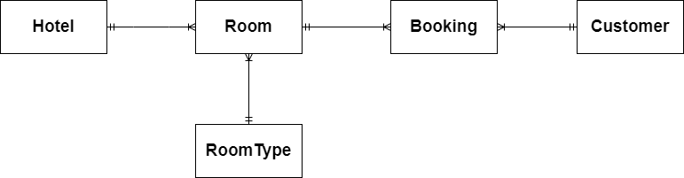

<!-- @import "[TOC]" {cmd="toc" depthFrom=1 depthTo=6 orderedList=false} -->

# AACS3013 May 2023 Answers

[Link to the paper](https://eprints.tarc.edu.my/23328/1/AACS3013.pdf)

- [Question 1](#question-1)
- [Question 2](#question-2)
- [Question 3](#question-3)
- [Question 4](#question-4)

## Answers

### Question 1

a) i)

Primary key is a unique identifier for each record in a database table. For instance, in a library management system, we will have a BOOKS table. In the BOOKS table, it contains BookID as a primary key to ensure that no two books can have the same identifier.

a) ii)


b) 

DBMS Functions : 
- Backup and Recovery management provides backup and data recovery procedures.
- Data dictionary management defines data elements and their relationships
- Data storage management stores data and related data entry forms, report definitions etc.

c)

- Data redundancy is when different and conflicting versions of the same data appear in different places.
- Metadata is the data about data in which end-user data are integrated and managed.
- Business rules are unambiguous description of a policy, procedure or principle within a specific organization.

d)

Database recovery facilities for backup and recovery : 
- Backup facilities provide a periodic backup (nightly or weekly) that produces a backup copy of the portion of or the entire database.
- Checkpoint facilities periodically refuse to accept any new transactions. All transactions in progress are completed and the journal files are brought up to date. At this point the system is in a quiet state and the database and transaction logs are synchronized.

### Question 2

a)



b)

HOTEL(<ins>HotelID</ins>, HotelName, Location)

ROOM(<ins>RoomID</ins>, FloorNo, HotelID\*, RoomTypeID\*)

ROOMTYPE(<ins>RoomTypeID</ins>, Description, Price)

CUSTOMER(<ins>CustomerID</ins>, CustomerName, ContactNo, Email, Country)

BOOKING(<ins>RoomID\*</ins>, <ins>CustomerID\*</ins>, <ins>CheckInDate</ins>, CheckOutDate)

### Question 3

a) 

- Insertion Anomaly: Insertion of new student data requires inserting redundant club, activity and advisor data.
- Modification Anomaly: Modification of the activity time of S011 is required to perform to all 2 records that have this activity to prevent data inconsistency.
- Deletion Anomaly: Deletion of the club name 'Volleyball' will remove the student information S423 from the database.

b)

**1NF**

CLUB(<ins>ClubCOde</ins>, ClubName, ActivityDay, ActivityTime, AdvisorID, AdvisorName, <ins>StudentID</ins>, StudentName, ContactNo, Programme)

> Use the entity name of the non-repeating group as the table name

**2NF**

REGISTRATION(<ins>ClubCode\*</ins>, <ins>StudentID\*</ins>)

CLUB(<ins>ClubCode</ins>, ClubName, ActivityDay, ActivityTime, AdvisorID, AdvisorName)

STUDENT(<ins>StudentID</ins>, StudentName, ContactNo, Programme)

**3NF**

REGISTRATION(<ins>ClubCode\*</ins>, <ins>StudentID\*</ins>)

CLUB(<ins>ClubCode</ins>, ClubName, ActivityDay, ActivityTime, AdvisorID\*)

ADVISOR(<ins>AdvisorID</ins>, AdvisorName)

STUDENT(<ins>StudentID</ins>, StudentName, ContactNo, Programme)

### Question 4

a) 

```sql
CREATE TABLE Loan (
	LoanID VARCHAR(7) NOT NULL,
	CallNum VARCHAR(10) NOT NULL,
	MemberNo VARCHAR(5) NOT NULL,
	BorrowDate DATE NOT NULL,
	DueDate DATE NOT NULL,
	ReturnDate DATE,
	Remark VARCHAR(200),
	PRIMARY KEY (LoanID),
	FOREIGN KEY (CallNum) REFERENCES Book(CallNum),
	FOREIGN KEY (MemberNo) REFERENCES Member(MemberNo)
);
```

b)

```sql
UPDATE Member
SET ContactNo = '016-8879878'
WHERE MemberNo = 'STU705';
```

c)

```sql
INSERT INTO Book (CallNum, ISBN, BookTitle, Author1, PublishedDate, PublisherNo) VALUES ('S10012345', 9001851234567, 'Lost In The Jungle', 'Krishnathan Makmur', '21-JAN-2021', 'KM101');
```

d)

```sql
DELETE FROM Loan
WHERE MemberNo = (
	SELECT MemberNo
	FROM Member
	WHERE MemberName = 'Samatha Suzy'
);
```

e)

```sql

```

