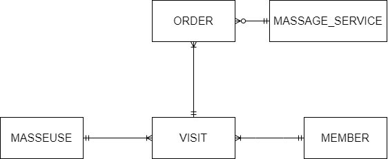

<!-- @import "[TOC]" {cmd="toc" depthFrom=1 depthTo=6 orderedList=false} -->

# AACS3013 JAN 2023 Answers

[Link to the paper](https://eprints.tarc.edu.my/23981/1/AACS3013.pdf)

- [Question 1](#question-1)
- [Question 2](#question-2)
- [Question 3](#question-3)
- [Question 4](#question-4)

## Answers

### Question 1

a) i)

- Data is raw facts about things and events that have no context, meanwhile, information is processed and organised data that has meaning.
- Data is often being used as input for a process, meanwhile, information is being used to interpret and support decision making.

b)

i) **Views** are a subset of database which is made by query that run on one or multiple tables in a database. View can restrict user access towards the underlying table directly, avoiding confidential data such as password being directly accessed and read by unauthorised user.

ii) **Authorisation rules** specifies the privileges on database operation that being granted to the user. This can ensure sensitive database operation to not be performed by any unauthorised users.

iii) **Authentication schemes** defines a method to obtain positive identification of a user. A strong authentication scheme ensures users identity and proper privileges can be granted to the users.

iv) **Encryption** uses algorithm to process the data into cipher which is non human-readable. The cipher can be decrypted with a key by the receiver to access to the data. This can ensure that the data is secured and cannot be interpreted by third-party.

c) i)

| ProductID | Name | Price |
| --------- | ---- | ----- |
| B001 | Body Wash | 50.80 |
| B002 | Body Lotion | 73.50 |
| B003 | Body Scrub | 59.90 |
| B004 | Body Sunscreen | 66.00 |
| H002 | Hand Cream | 35.90 |
| S001 | Shampoo | 48.30 |

c) ii)

| ProductID | Name | Price |
| --------- | ---- | ----- |
| B001 | Body Wash | 50.80 |
| B003 | Body Scrub | 59.90 |

c) iii)

| ProductID | Name | Price |
| --------- | ---- | ----- |
| B002 | Body Lotion | 73.50 |
| B004 | Body Sunscreen | 66.00 |

### Question 2

a)



b)

MASSAGE\_SERVICE(<ins>MassageID</ins>, MassageName, Description, Price)

MEMBER(<ins>MemberID</ins>, MemberName, BirthDate, MemberContactNo)

VISIT(<ins>VisitID</ins>, VisitDate, MemberID\*, MasseuseID\*)

MASSEUSE(<ins>MasseuseID</ins>, MasseuseName, MasseuseContactNo)

ORDER(<ins>MassageID\*</ins>, <ins>VisitID\*</ins>)

### Question 3

a) 

- Insertion Anomaly: Inserting new plane data need to insert redundant flight data.
- Modification Anomaly: Modifying depart time of flight TA6112 need to be made to all records that contains the specific flight, which is the first 3 records to avoid data inconsistency.
- Deletion Anomaly: Deletion of flight TA5352 will cause the data of plane P008 to be removed entirely from the database.

b)

**1NF**

FLIGHT(<ins>Flight\_No</ins>, From, To, Depart\_Time, Duration, Depart\_Date, <ins>Plane\_ID</ins>, Model, Manufacturer\_ID, Contact\_No)

> Use the **entity name of the non-repeating group** as the table name

**2NF**

FLIGHT(<ins>Flight\_No</ins>, From, To, Depart\_Time, Duration)

SCHEDULE(<ins>Flight\_No\*</ins>, <ins>Plane\_ID\*</ins>, <ins>Depart\_Date</ins>)

PLANE(<ins>Plane\_ID</ins>, Model, Manufacturer\_ID, Contact\_No)

> Break it down into **3 table**, which is one for **non-repeating group**, one for **repeating group** and one for **bridge entity**.
>
> Schedule uses composite key of flight\_no, plane\_id and **depart_date**, because the the same flight can uses the same plane for different depart date. Only including depart date can make the table's determinant unique.

**3NF**

FLIGHT(<ins>Flight\_No</ins>, From, To, Depart\_Time, Duration)

SCHEDULE(<ins>Flight\_No\*</ins>, <ins>Plane\_ID\*</ins>, <ins>Depart\_Date</ins>)

PLANE(<ins>Plane\_ID</ins>, Model, Manufacturer\_ID\*)

MANUFACTURER(<ins>Manufacturer\_ID</ins>, Contact\_No)

### Question 4

a) 

```sql
CREATE TABLE Transaction (
	TransactionNo VARCHAR(12) NOT NULL,
	TransactionDate DATE NOT NULL,
	AmountPaid NUMBER(7,2) NOT NULL,
	CardNo VARCHAR(16) NOT NULL,
	MerchantID VARCHAR(12) NOT NULL,
	PRIMARY KEY (TransactionNo),
	FOREIGN KEY (CardNo) REFERENCES CreditCard(CardNo),
	FOREIGN KEY (MerchantID) REFERENCES Merchant(MerchantID)
);
```

b)

```sql
INSERT INTO Merchant(MerchantID, MerchantName, MerchantContact, MerchantAddress)
VALUES ('000000123123', 'Joyful Book Store', '06-2818288', '2, Jalan Merdeka, 75000 Melaka');
```

c)

```sql
UPDATE CreditCard
SET ExpiryDate = '31-MAR-2026'
WHERE CardNo = '422334455667788';
```

d)

```sql
SELECT * FROM Customer
WHERE BillingAddress LIKE '%Kelantan';
```

e)

```sql
SELECT CR.CardNo, CR.Type, SUM(T.AmountPaid) "Total_Amount_Paid"
FROM CreditCard CR JOIN Transaction T ON (CR.CardNo = T.CardNo)
WHERE CR.CustomerIC = '931228071235' 
AND T.TransactionDate BETWEEN '1-DEC-2022' AND '31-DEC-2022'
GROUP BY CR.CardNo, CR.Type
ORDER BY "Total_Amount_Paid";
```

f)

```sql
DELETE FROM Merchant
WHERE MerchantID = '000007890133';
```
