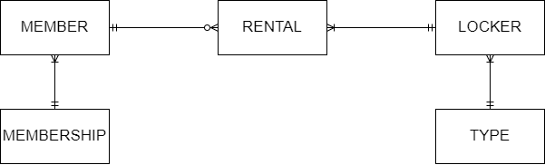

<!-- @import "[TOC]" {cmd="toc" depthFrom=1 depthTo=6 orderedList=false} -->

# AACS3013 May 2023 Answers

[Link to the paper](https://eprints.tarc.edu.my/25091/1/AACS3013.pdf)

- [Question 1](#question-1)
- [Question 2](#question-2)
- [Question 3](#question-3)
- [Question 4](#question-4)

## Answers

### Question 1

a) i)

Data is raw facts about things and events that have not yet been processed to reveal their meaning. 

a) ii)

Information is processed and interpreted data that has meaning and can support decision-making.

b) 

- Single-User Database (One user/time)
- Desktop Database (Single-User Database running on a personal computer)
- Multi-User Database (Multiple user/time)
- Workgroup Database (Multi-User Database supports a small group of users, eg. single department)
- Enterprise Database (Multi-User Database supports a large group of users, eg. a whole organisation)

c)

- Backup Facilities 
	- Provide periodic backup operation that creates a copy of the current database state
	- The backup copy will be stored in a secured off-site location waiting to be used to recover the database if encountering failure.
- Journalising Facilities
	- Record audit trails of the transaction made towards the database and changes in the database
	- Used to recover the most consistent database state together with the most recent backup copy

d)

- Data Administration is a high-level function responsible for managing data resources in an organisation. Some of the data administrator roles are to establish data policies and resolve data conflicts.
- Database Administration is a technical function responsible for physical database design. The database administrators are concerned with database configuration such as security enforcement and database performance.

### Question 2

a)



b)

MEMBER(<ins>Member\_ID</ins>, Name, Contact\_No, Membership\_Type\*)

MEMBERSHIP(<ins>Membership\_Type</ins>, Discount\_Rate)

LOCKER(<ins>Locker\_ID</ins>, Location, Type\*)

TYPE(<ins>Type\_ID</ins>, Description, Hourly\_Charges, Daily\_Charges, Monthly\_Charges, Yearly\_Charges)

RENTAL(<ins>Member\_ID\*</ins>, <ins>Locker\_ID\*</ins>, <ins>date</ins>, <ins>time</ins>, duration)

> RENTAL table uses composite key consists of Member\_ID, Locker\_ID, date and time.

### Question 3

a) 

- Insertion Anomaly: Insertion of new instructor data requires inserting redundant event and kid data.
- Modification Anomaly: Modification of event COL01's fees required to be performed to all 3 records that have this event to avoid data inconsistency.
- Deletion Anomaly: Deletion of event SIN010 will cause data instructor A005 to be entirely removed from the database.

b)

**1NF**

EVENT(<ins>EventID</ins>, Title, Fees, InstructorID, Name, InstructorHP, <ins>KidID</ins>, KidName, Sex, ParentHP, Day, Time)

> Use the entity name of the non-repeating group as the table name

**2NF**

EVENT(<ins>EventID</ins>, Title, Fees, InstructorID, Name, InstructorHP)

REGISTRATION(<ins>EventID\*</ins>, <ins>KidID\*</ins>, Day, Time)

KID(<ins>KidID</ins>, KidName, Sex, ParentHP)

**3NF**

REGISTRATION(<ins>EventID\*</ins>, <ins>KidID\*</ins>, Day, Time)

EVENT(<ins>EventID</ins>, Title, Fees, InstructorID\*)

INSTRUCTOR(<ins>InstructorID</ins>, Name, InstructorHP)

KID(<ins>KidID</ins>, KidName, Sex, ParentHP)

### Question 4

a) 

```sql
CREATE TABLE CookiesOrder (
	OrderID NUMBER(7) NOT NULL,
	OrderDate DATE NOT NULL,
	CookiesID NUMBER(5) NOT NULL,
	CustomerID NUMBER(7) NOT NULL,
	Quantity NUMBER(5) NOT NULL,
	PaymentStatus VARCHAR(6) NOT NULL,
	CollectDate DATE NOT NULL,
	PRIMARY KEY (OrderID),
	FOREIGN KEY (CookiesID) REFERENCES Cookies(CookiesID),
	FOREIGN KEY (CustomerID) REFERENCES Customer(CustomerID),
	CONSTRAINT chk_payment_status CHECK PaymentStatus IN ('PAID', 'UNPAID')
);
```

b)

```sql
UPDATE Cookies
SET Price = Price * 1.05
WHERE description LIKE '%cheese%';
```

c)

```sql
SELECT cr.CustomerID customer_id, COUNT(o.OrderID) total_transaction
FROM Customer cr JOIN CookiesOrder o ON (cr.CustomerID = o.CustomerID)
WHERE o.PaymentStatus = 'PAID'
GROUP BY cr.CustomerID;
```

d)

```sql
DELETE FROM CookiesOrder
WHERE CustomerID = (
	SELECT CustomerID
	FROM Customer
	WHERE CustomerName = 'James Bond'
) AND OrderDate = '23-FEB-2023';
```

e)

```sql
SELECT c.CookiesID Cookies_ID, SUM(c.Price * o.Quantity) Sales
FROM Cookies c JOIN CookiesOrder o ON (c.CookiesID = o.CookiesID)
WHERE (o.OrderDate BETWEEN '1-JAN-2023' AND '31-JAN-2023') AND (o.PaymentStatus = 'PAID')
GROUP BY c.CookiesID;
```
