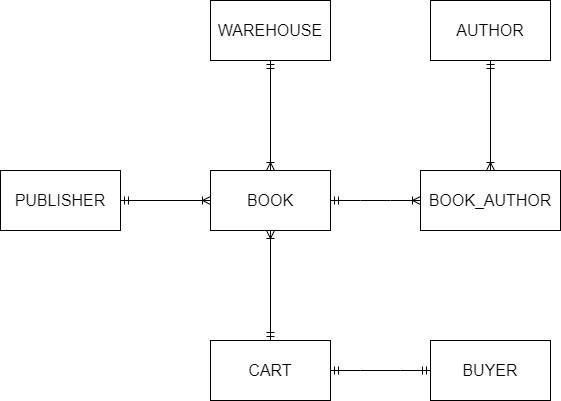

<!-- @import "[TOC]" {cmd="toc" depthFrom=1 depthTo=6 orderedList=false} -->

# AACS3013 October 2023 Answers

[Link to the paper](https://eprints.tarc.edu.my/26848/1/AACS3013.pdf)

- [Question 1](#question-1)
- [Question 2](#question-2)
- [Question 3](#question-3)
- [Question 4](#question-4)

## Answers

### Question 1

a)

- YouTube, Spotify, Facebook, WhatsApp, Instagram

b) 

- It is difficult to develop program for sophisticated processing such as concurrency control and security management for the video site.
- Ad hoc queries towards video metadata is impossible, because each report requires its own program, which takes time to develop.
- Access path to the video data will become hard to manage and tend to cause errors as the system complexity increases.

c)

- 4-tier client/server database architecture
- The database architecture consists of 4 tiers, which is client tier, web tier, application tier and data tier.
- This architecture isolates the users from directly making transaction to the database, ensure the validity of the database operation which secures the data within it. 
- Users only require to make request using the easy to understand web interface, and the server will return the desired result to the users on the web interface after making transaction to the database.

> **Steps**
>
> The user send their requests to service through the web interface at client tier, the web application logic and data validation will be done at web tier to ensure validity of the request.
>
> When the server receives the request at application tier, the server react to the request accodingly, including making transactions towards the database sitting in data tier.
>
> Lastly, the response is sent back to the user by displaying at the web interface.

d) 

- Create and manage backup strategy to store backup efficiently and reduce service downtime. For example, they must determine the database backup schedule and store backup securely in off-site location.
- Perform database recovery procedure when data loss and corruption occurs. They must plan for the most effective restoring and recovering technique to reduce downtime due to recovery operation.

e)

i) Backward Recovery

> Can think it as undo operation, to recover the database into the state before the aborted transaction occur

ii) Backward Recovery

iii) Switch to duplicate database created with disk mirroring technique

> The duplicate database is sitting in another isolated infrastructure, therefore it doesn't share resources with the other one and facing failure together.

iv) Switch to duplicate database created with disk mirroring technique

### Question 2

a)



b)

CART(<ins>cartID</ins>, colour)

BUYER(<ins>buyerID</ins>, name, address, email, phone, cartID\*)

BOOK(<ins>ISBN</ins>, title, year, price, warehouseID\*, cartID\*, publisherID\*)

WAREHOUSE(<ins>warehouseID</ins>, address, phone, quantity)

PUBLISHER(<ins>publisherID</ins>, address, phone, URL)

AUTHOR(<ins>authorID</ins>, name, address, phone)

BOOK\_AUTHOR(<ins>authorID\*</ins>, <ins>ISBN\*</ins>, dateWritten)

### Question 3

a) 

- Insertion Anomaly: Insertion of new hall data will require to insert redundant customer data.
- Modification Anomaly: Modifying hall name of hall H001 need to be made to every records with hall H001's data to avoid data inconsistency.
- Deletion Anomaly: Deletion of customer C1200 will remove the data of hall H005 entirely from the database.

b)

**1NF**

CUSTOMER(<ins>CustID</ins>, CustName, MembTypeID, MembTypeDesc, BookingDate, <ins>HallID</ins>, HallName, BlockID, BlockName)

**2NF**

CUSTOMER(<ins>CustID</ins>, CustName, MembTypeID, MembTypeDesc)

BOOKING(<ins>CustID\*</ins>, <ins>HallID\*</ins>, BookingDate)

HALL(<ins>HallID</ins>, HallName, BlockID, BlockName)

**3NF**

CUSTOMER(<ins>CustID</ins>, CustName, MembTypeID\*)

MEMBERSHIP(<ins>MembTypeID</ins>, MembTypeDesc)

BOOKING(<ins>CustID\*</ins>, <ins>HallID\*</ins>, BookingDate)

HALL(<ins>HallID</ins>, HallName, BlockID\*)

BLOCK(<ins>BlockID</ins>, BlockName)

c)

- Denormalisation is being used when the database processing speed is too slow due to adhering to normalisation requirement.
- Although normalised data reduce disk space and reduce data redundancy, but it creates large number of tables.
- Complex join operation on large number of tables increase disk input/output operation and logic processing which slows down the database response time
- Denormalisation able to reduce the amount of table in a database, by compromising disk space, to increase the database response time.

### Question 4

a) 

```sql
CREATE TABLE Customer (
	custID NUMBER(6) NOT NULL,
	custName VARCHAR(50) NOT NULL,
	custAddress VARCHAR(50) NOT NULL,
	custCity VARCHAR(30) NOT NULL,
	custState VARCHAR(3) NOT NULL,
	custPostalCode VARCHAR(5) NOT NULL,
	PRIMARY KEY (custID),
	CONSTRAINT chk_cust_state CHECK (custState IN ('JHR', 'SGR', 'MLK', 'NSN', 'KUL', 'PHG'))
);
```

b)

```sql
DELETE FROM Orders
WHERE custID = (
	SELECT custID FROM CUSTOMER
	WHERE custName = 'Jaime'
);
```

c)

```sql
UPDATE Customer
SET custCity = (
	SELECT custCity FROM Customer
	WHERE custID = 1008
),
custState = (
	SELECT custState FROM Customer
	WHERE custID = 1008
)
WHERE custID = 1002;
```

d)

```sql
SELECT * FROM Customer
WHERE custID NOT IN (
	SELECT custID FROM Orders
);
```

e)

```sql
SELECT prodFinish Product_Finish, AVG(p.prodPrice) Average_Product_Price
FROM Products
HAVING Average_Product_Price > 1000
GROUP BY Product_Finish
ORDER BY Product_Finish;
```
