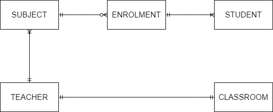

<!-- @import "[TOC]" {cmd="toc" depthFrom=1 depthTo=6 orderedList=false} -->

# AACS3013 January 2024 Answers

[Link to the paper](https://eprints.tarc.edu.my/27897/1/AACS3013.pdf)

- [Question 1](#question-1)
- [Question 2](#question-2)
- [Question 3](#question-3)
- [Question 4](#question-4)

## Answers

### Question 1

a)

- Data stored in database allows the information to be accessible by anyone within an organisation. The increased information accessibility could help in streamline business process and enhance overall productivity.
- Data stored in database allows reporting and data analysis through implementation of data warehouse. This could help in making business decision for more profit.
- Database can secure the data within it from unauthorised party accesses. This feature ensures the confidential data can be utilised by the organisation itself appropriately and avoid data leakage.
- Database enforces integrity rules which ensures the data integrity, preventing business failure caused by data inconsistencies. 

b) 

- records in file-based system is being stored without being able to recognize its relationship, meanwhile records in database management system store records that logically related in a single logical data repository.
- file-based system are being developed and maintained by each department within the organisation, meanwhile database management system centralize the data repository for the whole organisation.
- database management system is currently most used by the organisations due to its efficiency in data management.

c)

- Hardware failure, hardware failure causes the server unable to handle incoming client request, therefore client cannot access to the desired data on time
- Maintenance downtime, since server does not active during maintenance, it also cannot provide the data requested by the client
- Loss of data, data that is lossed and not backed up are unable to be retrieved again

d) i) 

Authorisation creates the rules for each types of users, which specify the permissions to create, retrieve, modify and delete data from the database. For example, only users who are lecturer will be authorised with the permission of generating attendance code.

d ii) 

Authentication ensures the user are providing accurate credentials to access to a account so the users have the right permission to access the data within the system. For example, students are required to login with their student ID and password before accessing the campus system and retrieve their result.

### Question 2

a)



b)

SUBJECT(<ins>subjectID</ins>, name, level, fee, teacherID\*)
STUDENT(<ins>studentIC</ins>, name, address, phone, email)
ENROLMENT(<ins>subjectID\*</ins>, <ins>studentIC\*</ins>, course, enrolmentDate)
TEACHER(<ins>teacherID</ins>, name, qualification, phone, email, roomID\*)
CLASSROOM(<ins>roomID</ins>, roomLevel)

c)

- A well designed ERD can facilitate a more effective communication among system designers, application programmers and end users
- The well designed ERD can provide a clear visualisation of data relationship. An ERD diagram that could be easily understood able to increase the database maintainability.
- Conceptual Data Model


### Question 3

a) 

- Insertion Anomaly: Insertion of new customer detail requires to insert redundant RentID and RentDate.
- Modification Anomaly: Modification of customer C001's phone number need to be made to first two row of records to avoid inconsistencies.
- Deletion Anomaly: Deletion of rental R002 will remove the customer information of C004 entirely from the database.

b)

- 1NF
RENTAL(<ins>RentID</ins>, RentDate, CustID, Name, PhoneNo, <ins>CarID</ins>, Model, Owner, ReturnDate, Amount)

- 2NF
RENTAL(<ins>RentID</ins>, RentDate, CustID, Name, PhoneNo, CarID\*, ReturnDate, Amount)
CAR(<ins>CarID</ins>, Model, Owner)

- 3NF
RENTAL(<ins>RentID</ins>, RentDate, CustID\*, CarID\*, ReturnDate, Amount)
CAR(<ins>CarID</ins>, Model, Owner)
CUSTOMER(<ins>CustID</ins>, Name, PhoneNo)

c)

Determinant is a field or a group of fields that controls or determines the values in another field. When a determinant is used to find the data within the database, exactly one record should be return as the result. 
The determinants in this database is RentID, CustID and CarID.

### Question 4

a) 

```sql
CREATE TABLE BorrowList (
	BorrowID VARCHAR(5) NOT NULL,
	BookID NUMBER(6) NOT NULL,
	Remarks VARCHAR(100),
	PRIMARY KEY (BorrowID, BookID),
	FOREIGN KEY (BorrowID) REFERENCES Borrow(BorrowID),
	FOREIGN KEY (BookID) REFERENCES Books(BookID)
);
```

b)

```sql
-- Borrow TABLE
INSERT INTO Borrow(BorrowID, BorrowDate, ReturnDate, StudID)
VALUES('BR001', '06-NOV-2023', '13-NOV-2023', 'S0001');

-- BorrowList TABLE
INSERT INTO BorrowList(BorrowID, BookID)
VALUES('BR001', 'B001');

INSERT INTO BorrowList(BorrowID, BookID)
VALUES('BR001', 'B002');
```

c)

```sql
UPDATE Borrow
SET ReturnDate = '17-NOV-2023'
WHERE BorrowID = 'BR004';
```

d)

```sql
DELETE FROM Books
WHERE Title LIKE '%Windows XP%';
```

e)

```sql
CREATE VIEW borrowing_view AS
SELECT s.StudID Student_ID, COUNT(b.BorrowID) Total_Borrowings
FROM Students s LEFT JOIN Borrow b ON (s.StudID = b.StudID)
WHERE b.BorrowDate IN BETWEEN '1-JAN-2023' AND '31-DEC-2023'
GROUP BY s.StudID;

SELECT * FROM borrowing_view
ORDER BY Total_Borrowings DESC;
```
