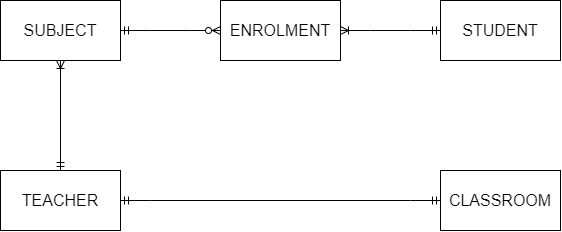

<!-- @import "[TOC]" {cmd="toc" depthFrom=1 depthTo=6 orderedList=false} -->

# AACS3013 January 2024 Answers

[Link to the paper](https://eprints.tarc.edu.my/27897/1/AACS3013.pdf)

- [Question 1](#question-1)
- [Question 2](#question-2)
- [Question 3](#question-3)
- [Question 4](#question-4)

## Answers

### Question 1

a)

- Data stored in a database allows the information to be accessible by anyone within an organisation. The increased information accessibility could help streamline business processes and enhance overall productivity.
- Data stored in a database allows reporting and data analysis through the implementation of the data warehouse. This could help in making business decisions for more profit.
- Database can secure the data within it from unauthorised parties. This feature ensures that confidential data can be utilised by the organisation itself appropriately and avoid data leakage.
- Database enforces integrity rules which ensures data integrity, preventing business failure caused by data inconsistencies. 

b) 

- records in a file-based system are being stored without being able to recognize their relationship, meanwhile records in a database management system store records that are logically related in a single logical data repository.
- file-based systems are being developed and maintained by each department within the organisation, meanwhile, database management systems centralize the data repository for the whole organisation.
- database management system is currently most used by organisations due to their efficiency in data management.

c)

- Hardware failure, hardware failure causes the server to be unable to handle incoming client requests, therefore the client cannot access the desired data on time
- Maintenance downtime, since the server is not active during maintenance, it also cannot provide the data requested by the client
- Loss of data, data that is lost and not backed up is unable to be retrieved again

d) i) 

Authorisation creates the rules for each type of user, which specify the permissions to create, retrieve, modify and delete data from the database. For example, only lecturers will be authorised to generate attendance codes.

d ii) 

Authentication ensures the users provide accurate credentials to log into an account so the users have the right permission to access the data within the system. For example, students are required to log in with their student ID and password before accessing the campus system and retrieving their results.

### Question 2

a)



b)

SUBJECT(<ins>subjectID</ins>, name, level, fee, teacherID\*)

STUDENT(<ins>studentIC</ins>, name, address, phone, email)

ENROLMENT(<ins>subjectID\*</ins>, <ins>studentIC\*</ins>, course, enrolmentDate)

TEACHER(<ins>teacherID</ins>, name, qualification, phone, email, roomID\*)

CLASSROOM(<ins>roomID</ins>, roomLevel)

c)

- A well designed ERD can facilitate more effective communication among system designers, application programmers and end users
- The well designed ERD can provide a clear visualisation of data relationships. An ERD diagram that could be easily understood can increase the database maintainability.
- Conceptual Data Model


### Question 3

a) 

- Insertion Anomaly: Insertion of new customer detail requires inserting redundant RentID and RentDate.
- Modification Anomaly: Modification of customer C001's phone number needs to be made to the first two rows of records to avoid inconsistencies.
- Deletion Anomaly: Deletion of rental R002 will remove the customer information of C004 entirely from the database.

b)

**1NF**

RENTAL(<ins>RentID</ins>, RentDate, CustID, Name, PhoneNo, <ins>CarID</ins>, Model, Owner, ReturnDate, Amount)

**2NF**

RENTAL(<ins>RentID</ins>, RentDate, CustID, Name, PhoneNo)

CAR_RENTAL(<ins>RentID\*</ins>, <ins>CarID\*</ins>, ReturnDate, Amount)

CAR(<ins>CarID</ins>, Model, Owner)

**3NF**

RENTAL(<ins>RentID</ins>, RentDate, CustID\*)

CUSTOMER(<ins>CustID</ins>, Name, PhoneNo)

CAR_RENTAL(<ins>RentID\*</ins>, <ins>CarID\*</ins>, ReturnDate, Amount)

CAR(<ins>CarID</ins>, Model, Owner)

> Each `RENTAL` may includes multiple `CAR`, meanwhile each `CAR` may be rented in multiple `RENTAL`.
>
> For the question's case, each `CAR` within a single `RENTAL` can have different return date and rental amount, therefore these data are
> belongs to the bridge table `CAR_RENTAL` due to the data is functionally dependent on both of the rental and the car.

c)

Determinant is a field or a group of fields that controls or determines the values in another field. When a determinant is used to find the data within the database, exactly one record should be returned as the result. 

The determinants in this database are RentID, CustID and CarID.

### Question 4

a) 

```sql
CREATE TABLE BorrowList (
	BorrowID VARCHAR(5) NOT NULL,
	BookID NUMBER(6) NOT NULL,
	Remarks VARCHAR(100),
	PRIMARY KEY (BorrowID, BookID),
	FOREIGN KEY (BorrowID) REFERENCES Borrow(BorrowID),
	FOREIGN KEY (BookID) REFERENCES Books(BookID)
);
```

b)

```sql
-- Borrow TABLE
INSERT INTO Borrow(BorrowID, BorrowDate, ReturnDate, StudID)
VALUES('BR001', '06-NOV-2023', '13-NOV-2023', 'S0001');

-- BorrowList TABLE
INSERT INTO BorrowList(BorrowID, BookID)
VALUES('BR001', 'B001');

INSERT INTO BorrowList(BorrowID, BookID)
VALUES('BR001', 'B002');
```

c)

```sql
UPDATE Borrow
SET ReturnDate = '17-NOV-2023'
WHERE BorrowID = 'BR004';
```

d)

```sql
DELETE FROM Books
WHERE Title LIKE '%Windows XP%';
```

e)

```sql
CREATE VIEW borrowing_view AS
SELECT s.StudID Student_ID, COUNT(b.BorrowID) Total_Borrowings
FROM Students s LEFT JOIN Borrow b ON (s.StudID = b.StudID)
WHERE b.BorrowDate IN BETWEEN '1-JAN-2023' AND '31-DEC-2023'
GROUP BY s.StudID;

SELECT * FROM borrowing_view
ORDER BY Total_Borrowings DESC;
```
